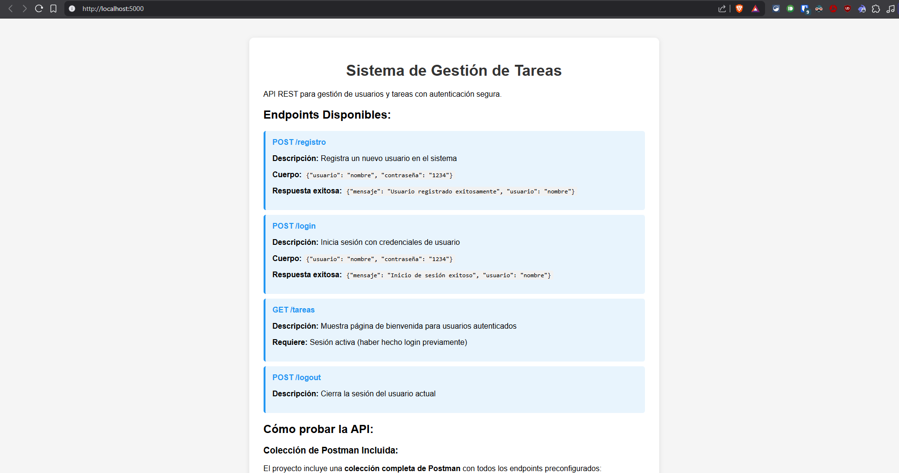
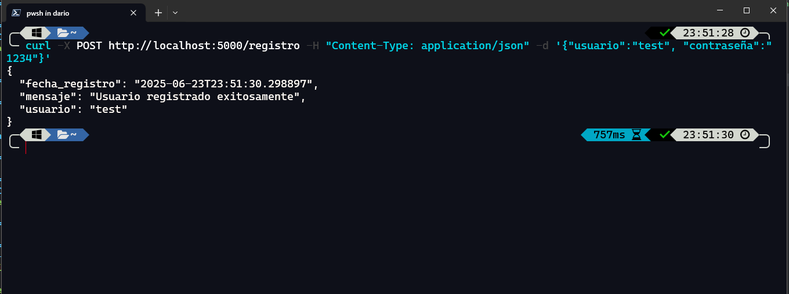
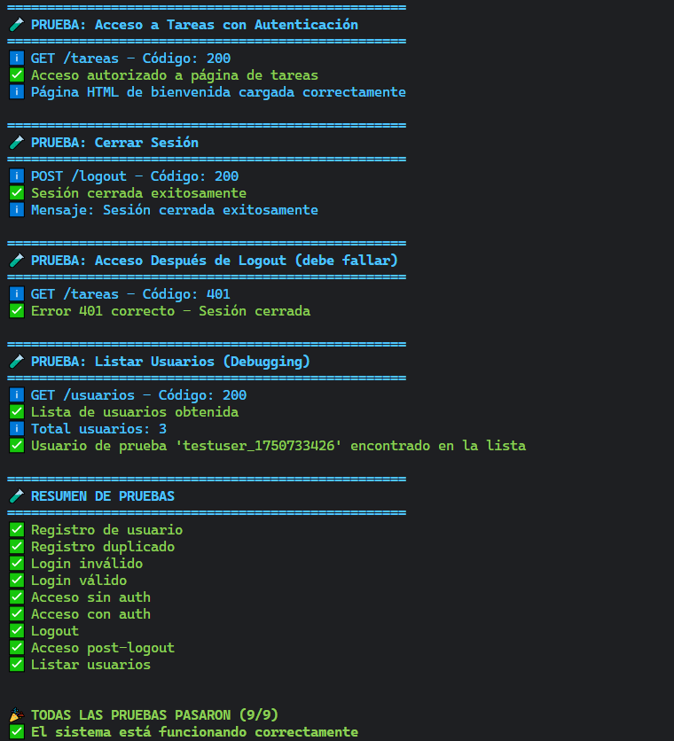
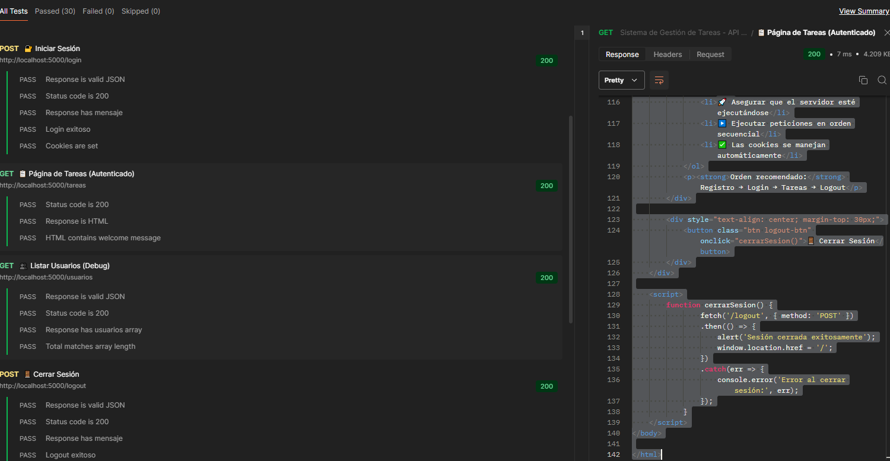

#  Sistema de Gestión de Tareas con API y Base de Datos

Sistema completo de gestión de tareas desarrollado con Flask, SQLite y autenticación segura con contraseñas hasheadas.

##  Características

-  API REST con Flask
-  Registro y autenticación de usuarios
-  Contraseñas hasheadas con Werkzeug
-  Base de datos SQLite para persistencia
-  Interfaz web de bienvenida

##  Requisitos

- Python 3.7+
- Flask
- Werkzeug (incluido con Flask)
- SQLite3 (incluido con Python)

##  Instalación

1. **Clonar el repositorio:**
```bash
git clone https://github.com/darioque/practica-formativa-2-redes
cd practica-formativa-2-redes
```

2. **Crear entorno virtual (recomendado):**
```bash
python -m venv .venv

# En Windows:
.venv\Scripts\activate

# En macOS/Linux:
source .venv/bin/activate
```

3. **Instalar dependencias:**
```bash
pip install -r requirements.txt
```

##  Ejecución

1. **Ejecutar el servidor:**
```bash
python servidor.py
```

2. **El servidor estará disponible en:**
```
http://localhost:5000
```

3. **La base de datos SQLite se creará automáticamente como `tareas.db`**

##  Endpoints de la API

### 1. Página de Inicio
- **URL:** `GET /`
- **Descripción:** Página principal con documentación de la API
- **Ejemplo:** 
```bash
curl http://localhost:5000/
```

### 2. Registro de Usuario
- **URL:** `POST /registro`
- **Content-Type:** `application/json`
- **Cuerpo:**
```json
{
    "usuario": "nombre_usuario",
    "contraseña": "mi_contraseña"
}
```
- **Respuesta exitosa (201):**
```json
{
    "mensaje": "Usuario registrado exitosamente",
    "usuario": "nombre_usuario",
    "fecha_registro": "20250-06-23T12:00:00"
}
```

### 3. Inicio de Sesión
- **URL:** `POST /login`
- **Content-Type:** `application/json`
- **Cuerpo:**
```json
{
    "usuario": "nombre_usuario",
    "contraseña": "mi_contraseña"
}
```
- **Respuesta exitosa (200):**
```json
{
    "mensaje": "Inicio de sesión exitoso",
    "usuario": "nombre_usuario",
    "fecha_login": "20250-06-23T12:00:00"
}
```

### 4. Página de Tareas (Requiere autenticación)
- **URL:** `GET /tareas`
- **Requiere:** Sesión activa (haber hecho login)
- **Respuesta:** Página HTML de bienvenida personalizada

### 5. Cerrar Sesión
- **URL:** `POST /logout`
- **Respuesta (200):**
```json
{
    "mensaje": "Sesión cerrada exitosamente"
}
```

### 6. Listar Usuarios (Debugging)
- **URL:** `GET /usuarios`
- **Respuesta (200):**
```json
{
    "usuarios": [
        {
            "id": 1,
            "usuario": "test_user",
            "fecha_registro": "20250-06-23 12:00:00"
        }
    ],
    "total": 1
}
```

##  Pruebas con CURL

### Registrar un usuario:
```bash
curl -X POST http://localhost:5000/registro \
  -H "Content-Type: application/json" \
  -d '{"usuario":"testuser", "contraseña":"1234"}'
```

### Iniciar sesión:
```bash
curl -X POST http://localhost:5000/login \
  -H "Content-Type: application/json" \
  -d '{"usuario":"testuser", "contraseña":"1234"}' \
  -c cookies.txt
```

### Acceder a tareas (con sesión):
```bash
curl -X GET http://localhost:5000/tareas \
  -b cookies.txt
```

### Cerrar sesión:
```bash
curl -X POST http://localhost:5000/logout \
  -b cookies.txt
```

##  Pruebas con Postman

### Configuración Automática
El proyecto incluye una **colección completa de Postman** con todos los endpoints preconfigurados.

**Archivo:** `coleccion-postman.json`

### Instalación y Configuración

1. **Abrir Postman:**
   - Descargar desde: https://postman.com/downloads/

2. **Importar la colección:**
   ```bash
   File → Import → Upload Files → Seleccionar "coleccion-postman.json"
   ```

3. **Verificar variables:**
   - `base_url`: http://localhost:5000 (automático)
   - `test_usuario`: Se genera automáticamente con timestamp
   - `test_password`: test1234 (predefinido)


### Ejecución Masiva

#### **Runner de Postman:**
```bash
1. Seleccionar la colección
2. Click en "Run collection"
3. Ejecutar todas las peticiones automáticamente
4. Ver reporte de resultados
```

##  Capturas de Pantalla de Pruebas

### 1. Página Principal (GET /)

*Muestra la documentación de la API y endpoints disponibles*

### 2. Curl


### 3. Testing Script


### 4. Postman


## Estructura de la Base de Datos

### Tabla `usuarios`
```sql
CREATE TABLE usuarios (
    id INTEGER PRIMARY KEY AUTOINCREMENT,
    usuario TEXT UNIQUE NOT NULL,
    password_hash TEXT NOT NULL,
    fecha_registro TIMESTAMP DEFAULT CURRENT_TIMESTAMP
);
```

### Tabla `tareas` (preparada para futuras implementaciones)
```sql
CREATE TABLE tareas (
    id INTEGER PRIMARY KEY AUTOINCREMENT,
    usuario_id INTEGER,
    titulo TEXT NOT NULL,
    descripcion TEXT,
    completada BOOLEAN DEFAULT FALSE,
    fecha_creacion TIMESTAMP DEFAULT CURRENT_TIMESTAMP,
    FOREIGN KEY (usuario_id) REFERENCES usuarios (id)
);
```

## Seguridad Implementada

- **Contraseñas hasheadas:** Uso de `werkzeug.security.generate_password_hash()`
- **Verificación segura:** Comparación con `check_password_hash()`
- **Manejo de errores:** Respuestas estructuradas sin exposición de información sensible


## Despliegue en GitHub Pages

 **Acceso:** `https://darioque.github.io/`


##  Respuestas

###  Por qué hashear contraseñas?

### Definición
El hasheo de contraseñas es el proceso de convertir una contraseña en texto plano en una cadena de caracteres irreversible mediante algoritmos criptográficos.

### Razones Fundamentales

#### 1. **Seguridad ante Brechas de Datos**
- **Problema:** Si alguien accede a la base de datos, las contraseñas en texto plano quedan completamente expuestas
- **Solución:** Con hasheo, incluso si acceden a la BD, solo ven cadenas sin sentido como `pbkdf2:sha256:260000$xyz...`
- **Ejemplo real:** En 2013, Adobe sufrió una brecha que expuso 150 millones de contraseñas, pero como estaban hasheadas, fue más difícil usarlas

#### 2. **Protección contra Personal Interno**
- **Problema:** Administradores de sistemas o desarrolladores podrían ver contraseñas
- **Solución:** Ni siquiera el equipo técnico puede ver las contraseñas originales
- **Beneficio:** Cumple con principios de "zero knowledge" y privacidad


### Ventajas de usar SQLite en este proyecto

### Definición

SQLite es una biblioteca de base de datos SQL embebida, autocontenida, sin servidor y de configuración cero.

### Ventajas Específicas para Este Proyecto

#### 1. **Simplicidad de Implementación**
```python
# No necesita servidor separado
conn = sqlite3.connect('tareas.db') 

# Comparado con PostgreSQL:
# 1. Instalar PostgreSQL server
# 2. Configurar usuario/contraseña
# 3. Crear base de datos
# 4. Configurar conexiones
# 5. Manejar dependencias 
```

#### 2. **Zero Configuration**
- **No requiere instalación:** Viene incluido con Python
- **No requiere configuración:** Sin usuarios, puertos, o permisos complejos


#### 3. **Atomicidad y Transacciones ACID**
```python
conn = sqlite3.connect('tareas.db')
conn.execute('BEGIN TRANSACTION')
try:
    conn.execute('INSERT INTO usuarios...')
    conn.execute('INSERT INTO tareas...')
    conn.commit()  # Todo o nada
except:
    conn.rollback()  # Restaura estado anterior
```
